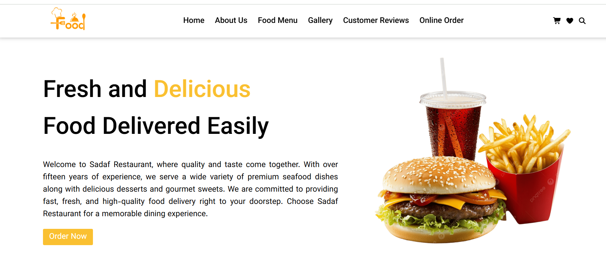
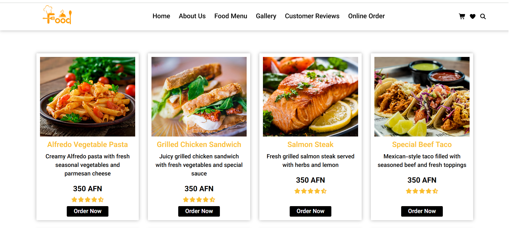
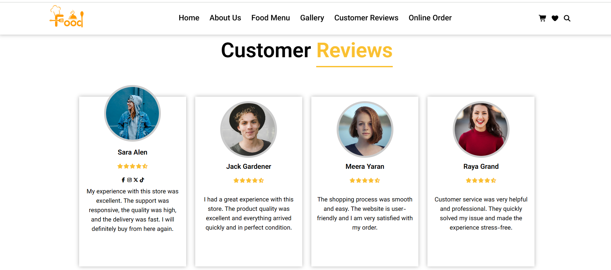

# 🍽️ Restaurant Website

A modern and clean **Restaurant Website UI** built with **React (Vite)** and **CSS**.

This project is part of a continuous frontend learning journey and will be improved step by step with new features, responsiveness, and interactivity over time.

---

## 📁 Project Structure

```text
restaurant-project/
├── public/
├── src/
│   ├── assets/
│   ├── components/
│   │   ├── Header.jsx
│   │   ├── HeroSection.jsx
│   │   ├── Main.jsx
│   │   ├── Footer.jsx
│   │   └── ...
│   ├── index.css
│   ├── App.jsx
│   └── main.jsx
├── .gitignore
├── eslint.config.js
├── index.html
├── package.json
├── package-lock.json
├── README.md
└── vite.config.js
```


---

## 🚀 Tech Stack
- React (Vite)
- CSS (Vanilla CSS)
- JavaScript (planned for future development)

---

## Current Features

The project currently includes a complete **static UI design** with the following sections:

- Header / Navigation
- Hero Section
- About Section
- Menu Section
- Gallery Section
- Customer Reviews
- Online Order Section
- Our Team Section
- Footer

> ⚠️ All sections are currently UI-only (no dynamic functionality yet).

---

## Responsive Design
- Desktop layout is fully completed
- Mobile, tablet, and desktop responsiveness have been fully completed
- UI is now fully optimized for all devices

---

## Project Status

This project is currently in an **active development phase**:

- UI design completed
- Fully responsive design completed
- JavaScript functionality planned
- Future enhancements and backend integration (optional)

---

## Purpose of This Project

This is not a real restaurant website. It is a **portfolio project** created for GitHub to:

- Practice React fundamentals
- Improve UI/UX design skills
- Build real-world frontend structure
- Track consistent learning progress
- Strengthen frontend development workflow

---

## Future Improvements

Planned updates include:

- Fully responsive mobile-first design
- Adding interactivity with JavaScript
- Form handling (orders / contact section)
- UI animations and transitions
- Component refactoring and optimization
- Possible backend integration in future stages

---

## Screenshots

### Home Section


### Menu Section


### Customer Review


---

## 📌 Notes

This project is part of a continuous learning path and will evolve over time as new skills are learned and implemented.
